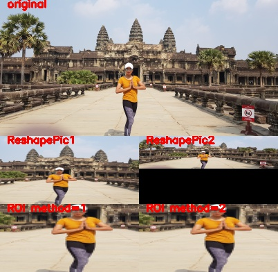

# trt_pose_tools

This programm is made for run on jetson nano and contain additional tools for nvidia [trt_pose](https://github.com/NVIDIA-AI-IOT/trt_pose/tree/master/trt_pose) library.

Install's instructions are available in the [README.md file](https://github.com/NVIDIA-AI-IOT/trt_pose/blob/master/README.md) of the trt_pose project.

## trt_pose_tools' content

### parser package

This package contain the parser for Image and Video.
First load the model and the ParseObject.

- tools

Tools for reshape frame:

1) ReshapePic1: resize the picture and crop the center
2) ReshapePic2: resize the picture and complete with black pixels
3) ROI: extract a Region Of Interest and reshape it with the previous method

```python
frame = cv2.imread("รูปรจนาที่อังกอร์.jpg")
x, y, _ = frame.shape


# Remove a few pixels to make the x/20 ,y/20
# Resize frame to be a tenth of the initial frame 
x -= x % 20
y -= y % 20
frame = frame[:x, :y]

x //= 10
y //= 10

frame = cv2.resize(frame, (y, x), interpolation=cv2.INTER_AREA)

rsp1 = ReshapePic1(shape=(x//2, y//2, 3))
rsp2 = ReshapePic2(shape=(x//2, y//2, 3))
rsp3 = ROI(shape=(x//2, y//2, 3))

# Reshape the frame
fr1 = rsp1(frame)
fr2 = rsp2(frame)
fr3_1 = rsp3(frame, (90, 130), (190, 230), method=1)
fr3_2 = rsp3(frame, (90, 130), (190, 230), method=2)

cv2.putText(frame, "original", (10, 10), cv2.FONT_HERSHEY_SIMPLEX, .5, (0, 0, 255), 2)
cv2.putText(fr1, "ReshapePic1", (10, 10), cv2.FONT_HERSHEY_SIMPLEX, .5, (0, 0, 255), 2)
cv2.putText(fr2, "ReshapePic2", (10, 10), cv2.FONT_HERSHEY_SIMPLEX, .5, (0, 0, 255), 2)
cv2.putText(fr3_1, "ROI method=1", (10, 10), cv2.FONT_HERSHEY_SIMPLEX, .5, (0, 0, 255), 2)
cv2.putText(fr3_2, "ROI method=2", (10, 10), cv2.FONT_HERSHEY_SIMPLEX, .5, (0, 0, 255), 2)

# Create a new frame and add the previous frame
fr = np.zeros((x*2, y, 3))
fr[:x, :y,:] += frame
fr[x:x+x//2, :y//2] = fr1
fr[x:x+x//2, y//2:] = fr2
fr[x+x//2:, :y//2] = fr3_1
fr[x+x//2:, y//2:] = fr3_2

#Save the result
cv2.imwrite(filename='img_doc/parser_tools.jpg', img=fr)
```




```python
import cv2
import trt_pose.coco
from trt_pose.parse_objects import ParseObjects
import torch2trt
import json
from parser.tools import ReshapePic1

#Load the model
mdl = "resnet18_baseline_att_224x224_A_epoch_249_trt.pth"
model_trt = torch2trt.TRTModule()
model_trt.load_state_dict(torch.load(mdl))

# Instantiate a ParsObjects
topology = "trt_pose/tasks/human_pose/human_pose.json"
with open(topology, 'r') as f:
    human_pose = json.load(f)
topology = trt_pose.coco.coco_category_to_topology(human_pose)
parse_object = ParseObjects(topology)

rsp = ReshapePic1(shape=(224,224,3))
```

- Image parser
```python
from parser.image_parser import ImageParser
# Capture a single frame using the web cam
cap = cv2.VideoCapture(0)
_, frame = cap.read()
cap.release()

# Reshape the frame
frame = rsp(frame)

# Parse frame
img_parser = ImageParser(trt_model=model_trt, parse_objects=parse_objects)
result = image_parser(frame=frame, max_detection=100)
```

- Video parser
```python
from parser.video_parser import VideoParser, YouTube_VideoParser
url = "https://www.youtube.com/watch?v=0z3fw2yXC5I"

vdo_parser = VideoParser(trt_model=model_trt, parse_objects=parse_objects)
yt_parser = YouTube_VideoParser(trt_model=model_trt, parse_objects=parse_objects)

# Parse a YouTube video
tensor = yt_parser(video_url=url, max_detection=100, reshape_frame=rsp)

# Create a generator using the webcam returning the detected keypoints on the 5 last frame
stream = vdo_parser.stream(video_path=0, max_detection=100, stream_size=5, reshape_frame=rsp)

# Iterate on stream
while True:
    try:
        z = next(stream)
    except:
        z = None
        break
```


## Package Tracking


