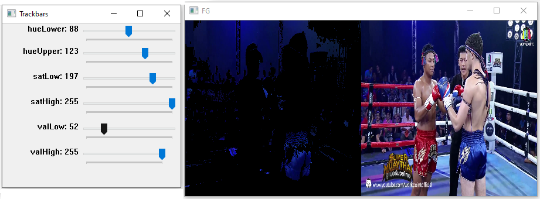
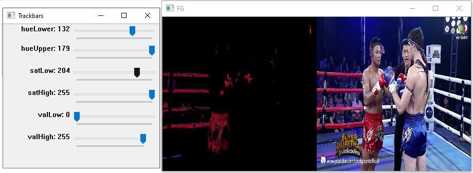

# Tool package

This package contains tools.

## [color_range](color_range.py)

Find the best HSV range to perform color tracking.

- Press "d" to switch between play the video, or change the frame when press a key.

- Press "q" to quit the analysis.

- Press "s" to save the configuration.

- Press "u" after updating the range to visualize the results on the same frame. 
```python
import cv2
from tools.color_range import HSV_Range

color_finder = HSV_Range()  # Instanciation 
cam = cv2.VideoCapture(0)  # Create a VideoCapture
color_finder(cam)
```


- Press "S" to save the config



- Press "S" to save the config

```python
hsvRange = color_finder.getBounds()  # Return the saved ranges

upperBound = hsvRange[:, :, :, 0]
lowerBound = hsvRange[:, :, :, 1]
```


## [frame_reshaping](frame_reshaping.py)

Tools for reshape frame:

1) ReshapePic1: resize the picture and crop the center
2) ReshapePic2: resize the picture and complete with black pixels
3) ROI: extract a Region Of Interest and reshape it with the previous method

```python
import cv2
from tools.frame_reshaping import ReshapePic1, ReshapePic2, ROI

frame = cv2.imread("รูปรจนาที่อังกอร์.jpg")
x, y, _ = frame.shape


# Remove a few pixels to make the x/20 ,y/20
# Resize frame to be a tenth of the initial frame 
x -= x % 20
y -= y % 20
frame = frame[:x, :y]

x //= 10
y //= 10

frame = cv2.resize(frame, (y, x), interpolation=cv2.INTER_AREA)

rsp1 = ReshapePic1(shape=(x//2, y//2, 3))
rsp2 = ReshapePic2(shape=(x//2, y//2, 3))
rsp3 = ROI(shape=(x//2, y//2, 3))

# Reshape the frame
fr1 = rsp1(frame)
fr2 = rsp2(frame)
fr3_1 = rsp3(frame, (90, 130), (190, 230), method=1)
fr3_2 = rsp3(frame, (90, 130), (190, 230), method=2)

cv2.putText(frame, "original", (10, 10), cv2.FONT_HERSHEY_SIMPLEX, .5, (0, 0, 255), 2)
cv2.putText(fr1, "ReshapePic1", (10, 10), cv2.FONT_HERSHEY_SIMPLEX, .5, (0, 0, 255), 2)
cv2.putText(fr2, "ReshapePic2", (10, 10), cv2.FONT_HERSHEY_SIMPLEX, .5, (0, 0, 255), 2)
cv2.putText(fr3_1, "ROI method=1", (10, 10), cv2.FONT_HERSHEY_SIMPLEX, .5, (0, 0, 255), 2)
cv2.putText(fr3_2, "ROI method=2", (10, 10), cv2.FONT_HERSHEY_SIMPLEX, .5, (0, 0, 255), 2)

# Create a new frame and add the previous frame
fr = np.zeros((x*2, y, 3))
fr[:x, :y,:] += frame
fr[x:x+x//2, :y//2] = fr1
fr[x:x+x//2, y//2:] = fr2
fr[x+x//2:, :y//2] = fr3_1
fr[x+x//2:, y//2:] = fr3_2

#Save the result
cv2.imwrite(filename='img_doc/parser_tools.jpg', img=fr)
```


